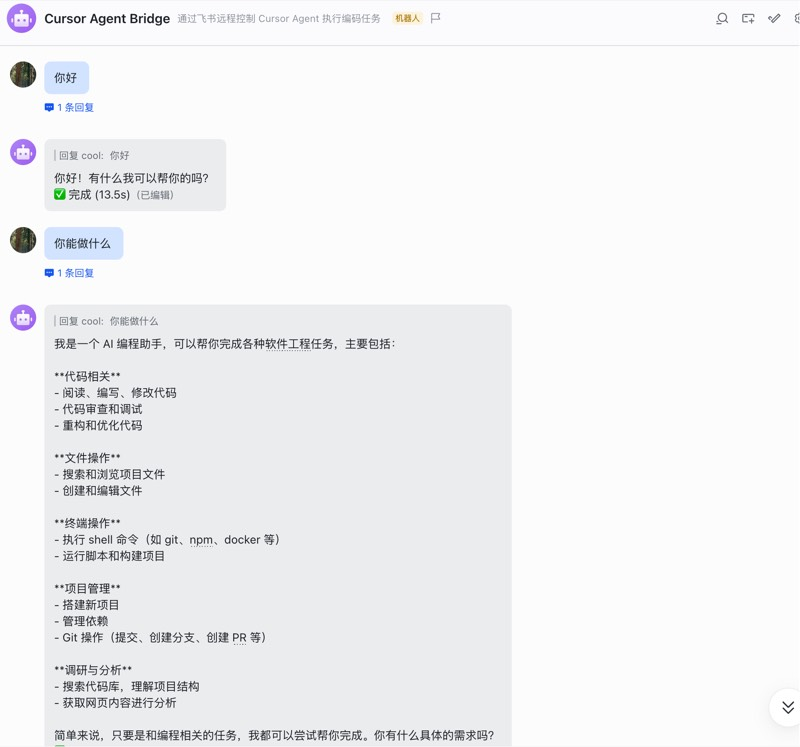
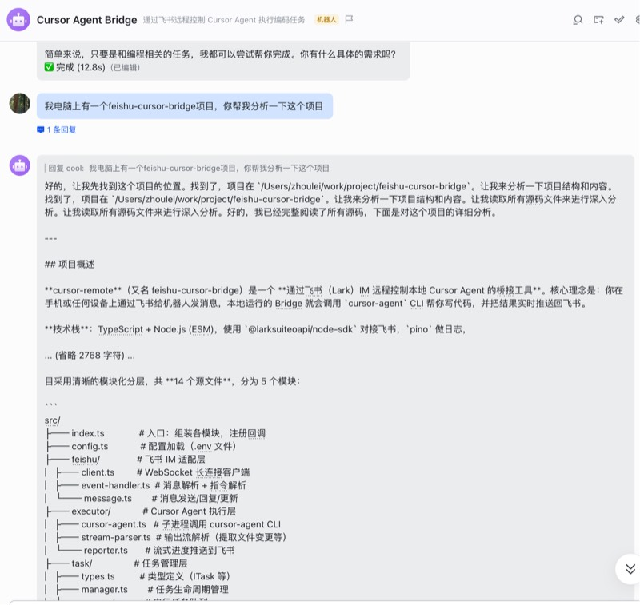
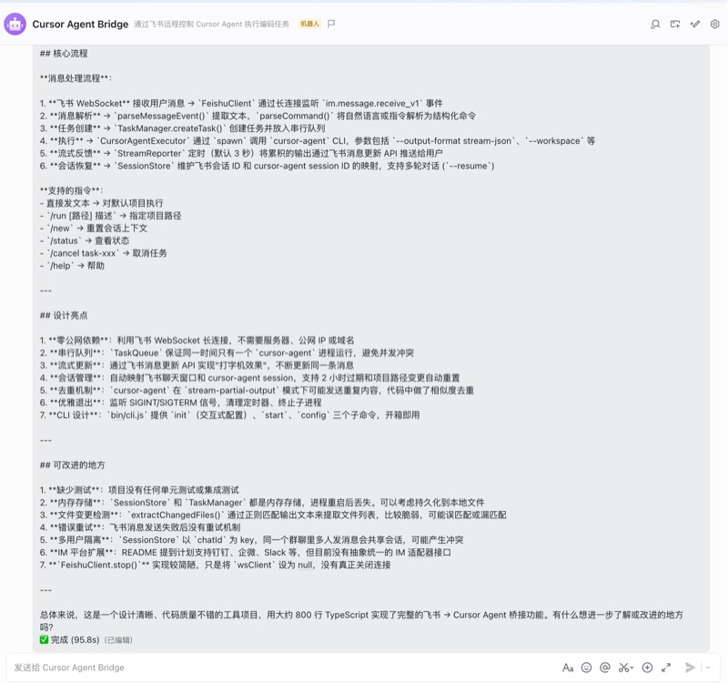
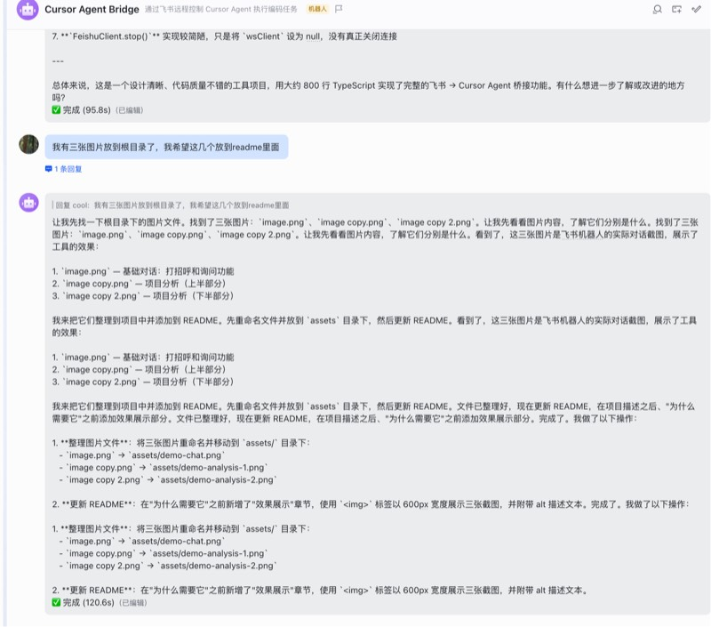
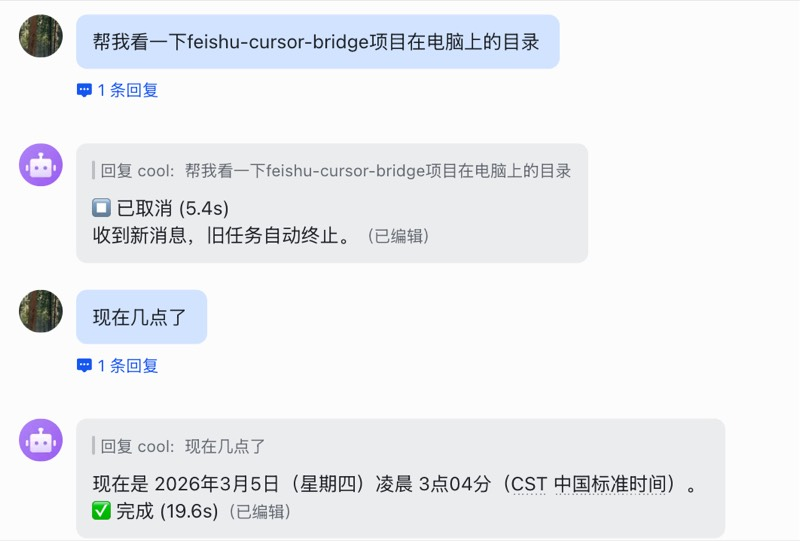

# cursor-remote

通过 IM 聊天远程控制本地 Cursor Agent — 发条消息就能让 AI 帮你写代码。

```
你: 帮我给 Button 组件加个 loading 状态
🤖: 正在分析项目结构...
🤖: ✅ 完成 (32.5s)
    修改文件: components/Button.tsx, Button.module.css
```

## 效果展示

### 💬 自然语言对话

直接给机器人发消息，像和同事聊天一样。



### 🔍 项目分析

让 Agent 帮你分析项目结构、理解代码逻辑。





### ⏳ 实时进度 → ✅ 任务完成

飞书支持**消息编辑**，Agent 执行过程中进度会实时更新到同一条消息上，无需等到任务结束。




### ⏹️ 新消息自动中断旧任务

发了新消息？正在执行的旧任务会自动取消，立即开始处理新请求。




## 为什么需要它

Cursor 是一个强大的 AI 编程助手，但你必须坐在电脑前才能用。

**cursor-remote** 把 Cursor Agent 接入你日常使用的 IM 工具，随时随地远程操控：

- 🛋️ **不在工位也能写代码** — 开会时想到一个 bug，发条消息就能修
- 📱 **手机上就能操作** — 通勤路上、午饭时间，随时给 AI 下任务
- 💬 **自然语言交互** — 不需要任何特殊格式，直接说人话
- 🔄 **多轮对话** — 同一聊天窗口内自动保持上下文，像和同事聊天一样
- 📡 **实时进度可见** — 利用飞书消息编辑能力，执行过程实时更新到同一条消息，打开聊天即可掌握进度

## 支持的 IM 平台

| 平台 | 状态 | 说明 |
|---|---|---|
| **飞书 / Lark** | ✅ 已支持 | WebSocket 长连接，零公网依赖 |
| 钉钉 | 🔜 计划中 | — |
| 企业微信 | 🔜 计划中 | — |
| Slack | 🔜 计划中 | — |
| Telegram | 🔜 计划中 | — |

欢迎 PR 贡献新平台的适配！

## 设计理念

### 零公网依赖

没有服务器，没有公网 IP，不需要域名。利用 IM 平台的 **WebSocket 长连接**机制，本地进程主动连上 IM 服务器。你的代码不会经过任何中间服务器。

### 三步上手

```bash
npm i -g cursor-remote    # 安装
cursor-remote init         # 配置
cursor-remote start        # 启动
```

### 架构透明

```
IM 用户 → WebSocket → 本地 Bridge → cursor-agent CLI → 你的项目目录
                                  ↓
                          结果推送回 IM
```

没有黑盒。Bridge 只做三件事：接收消息、调用 cursor-agent、把结果发回去。

## 快速开始

### 🚀 一键安装（推荐）

推荐使用 Cursor Agent 模式（Claude Opus 4.6 模型），使用以下提示词快捷安装：

```
根据 https://github.com/zhoulei-source/cursor-remote 帮我链接飞书与 Cursor Agent
首先给出部署计划，再一步步执行
如果过程中需要我提供啥信息请告诉我，你可以调用已有 MCP 服务，或写脚本等完成此任务
```

### 前置条件

- **Node.js** >= 18
- **Cursor** 已安装且有 `cursor-agent` 命令
- 一个已配置好的 **IM 应用**（见下方各平台配置指南）

### 安装

```bash
npm i -g cursor-remote
```

### 初始化配置

```bash
cursor-remote init
```

交互式引导你输入 IM 凭证、项目路径等，配置保存在 `~/.cursor-remote/config.env`。

### 启动

```bash
cursor-remote start
```

看到以下日志说明成功：

```
Cursor Remote 启动中...
WebSocket 长连接已启动
已就绪，等待消息...
```

现在去 IM 里找到你的机器人，发条消息试试！

## 飞书应用配置指南

<details>
<summary>📖 点击展开飞书配置步骤</summary>

1. 打开 [飞书开放平台](https://open.feishu.cn)，创建「企业自建应用」
2. 添加应用能力 → 启用「机器人」
3. 事件与回调 → 加密策略选择「使用长连接接收事件」
4. 添加事件订阅：`im.message.receive_v1`（接收消息）
5. 权限管理 → 添加以下权限：
   - `im:message` — 读取消息
   - `im:message:send_as_bot` — 以机器人身份发消息
   - `im:chat` — 获取会话信息
6. 版本管理与发布 → 创建版本并发布
7. 记下 **App ID** 和 **App Secret**，在 `cursor-remote init` 时填入

</details>

## 聊天中的使用方式

### 直接对话（最常用）

直接给机器人发消息，像和同事聊天一样：

```
你: 帮我看看项目里有哪些 TODO 注释
你: 把 utils/date.ts 里的日期格式化函数改成支持时区
你: 写一个单元测试覆盖 UserService 的核心方法
```

同一个聊天窗口内**自动保持上下文**，AI 记得之前聊了什么。

### 指令

| 指令 | 说明 | 示例 |
|---|---|---|
| 直接发文本 | 对默认项目执行任务 | `重构一下 login 页面的表单验证逻辑` |
| `/run <路径> <描述>` | 指定项目路径执行 | `/run ~/work/my-app 添加暗色模式` |
| `/new` | 开启新会话（清除上下文） | `/new` |
| `/status` | 查看当前任务/会话状态 | `/status` |
| `/cancel <task-id>` | 取消正在执行的任务 | `/cancel task-a1b2c3` |
| `/help` | 显示帮助信息 | `/help` |

### 执行过程

```
你: 给 Button 组件添加 loading 状态支持

🤖: 🤔 思考中...
🤖: [实时更新] 正在分析组件结构... ⏳ 执行中...
🤖: 完成内容摘要...
    📝 修改文件: components/Button.tsx, Button.module.css
    ✅ 完成 (45.2s)
```

## CLI 参考

```bash
cursor-remote <命令> [选项]
```

| 命令 | 说明 |
|---|---|
| `init` | 交互式初始化配置 |
| `start` | 启动服务（默认） |
| `config` | 查看当前配置状态 |

| 选项 | 说明 |
|---|---|
| `--project=<路径>` | 覆盖默认项目路径 |
| `--env=<路径>` | 指定配置文件路径 |
| `--debug` | 开启调试日志 |
| `-v, --version` | 显示版本号 |
| `-h, --help` | 显示帮助信息 |

### 示例

```bash
# 基本启动
cursor-remote start

# 指定项目路径
cursor-remote start --project=~/work/my-project

# 调试模式
cursor-remote start --debug

# 查看配置
cursor-remote config
```

## 配置项

配置文件位置：`~/.cursor-remote/config.env`

| 变量 | 必填 | 默认值 | 说明 |
|---|---|---|---|
| `FEISHU_APP_ID` | ✅ | - | 飞书应用 App ID |
| `FEISHU_APP_SECRET` | ✅ | - | 飞书应用 App Secret |
| `DEFAULT_PROJECT_PATH` | - | 当前目录 | 默认项目路径 |
| `CURSOR_AGENT_PATH` | - | 自动检测 | cursor-agent 二进制路径 |
| `LOG_LEVEL` | - | `info` | 日志级别 (debug/info/warn/error) |
| `STREAM_PUSH_INTERVAL` | - | `3000` | 流式推送间隔（毫秒） |
| `TASK_TIMEOUT` | - | `600000` | 任务超时时间（毫秒） |

## 架构

```
┌──────────┐     WebSocket      ┌──────────────────────────────────┐
│          │  ◄──────────────►  │  cursor-remote (本地运行)        │
│  IM 用户  │                    │                                  │
│ 飞书/钉钉 │   IM API 回复      │  ┌────────┐    ┌──────────────┐  │
│  企微/..  │  ◄────────────────  │  │消息解析 │───►│ 任务管理器    │  │
└──────────┘                    │  └────────┘    └──────┬───────┘  │
                                │                       │          │
                                │  ┌────────────┐ ┌─────▼───────┐  │
                                │  │ IM Adapter │ │Cursor Agent │  │
                                │  │ 飞书/钉钉/..│ │  执行器      │  │
                                │  └────────────┘ └─────┬───────┘  │
                                │                       │          │
                                │               ┌───────▼───────┐  │
                                │               │  cursor-agent │  │
                                │               │    CLI 进程    │  │
                                │               └───────────────┘  │
                                └──────────────────────────────────┘
```

**核心模块：**

- **IM Adapter** — 各平台适配器（当前：飞书 WSClient 长连接）
- **消息解析器** — 用户消息 → 结构化指令，支持自然语言和 `/run` 等命令
- **任务管理器** — 任务生命周期管理 + 串行队列，防止并发冲突
- **Cursor Agent 执行器** — 子进程调用 `cursor-agent`，stream-json 流式解析
- **会话管理** — IM 会话 ↔ cursor-agent session 映射，支持多轮对话
- **流式推送** — 定时批量更新 IM 消息，实时展示执行进度

## 贡献新的 IM 平台

欢迎贡献！添加新的 IM 平台适配器只需实现以下接口：

1. **连接管理** — 建立与 IM 平台的长连接
2. **消息接收** — 接收用户消息并解析为统一格式
3. **消息发送** — 发送/回复/更新消息

可参考 `src/feishu/` 目录的实现。

## 常见问题

### cursor-agent 命令找不到？

确保 Cursor 已安装，然后检查：

```bash
# macOS / Linux
ls ~/.local/bin/cursor-agent

# 或在配置中手动指定路径
# CURSOR_AGENT_PATH=/path/to/cursor-agent
```

### 飞书收不到消息？

1. 确认应用已发布（不是草稿状态）
2. 确认已添加 `im.message.receive_v1` 事件订阅
3. 确认事件接收方式选的是「长连接」而不是 HTTP
4. 确认机器人已被添加到对话中

### 任务超时？

默认超时 10 分钟，可在配置中调整：

```env
TASK_TIMEOUT=1200000  # 20 分钟
```

### 如何后台常驻运行？

```bash
# 使用 nohup
nohup cursor-remote start &

# 或使用 pm2
pm2 start cursor-remote -- start
```

## License

MIT
